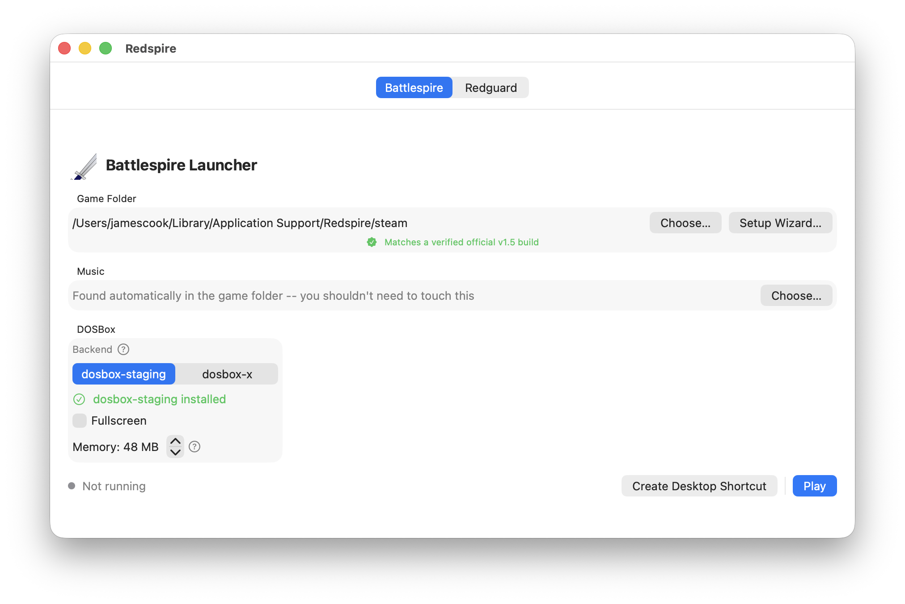

# Redspire

A native macOS app for playing two classic Bethesda DOS games on Apple
Silicon, via DOSBox — no Wine/CrossOver, no Rosetta. The name's a portmanteau
of the two games it supports:

- *The Elder Scrolls Legend: Battlespire* (1997)
- *The Elder Scrolls Adventures: Redguard* (1998)

You need to own a legitimate copy of whichever game you want to play — GOG,
Steam, or the original disc(s). This repo contains no game files or
copyrighted assets, just the launcher app and setup instructions.



## Getting started

Download the latest release from the [Releases
page](https://github.com/jamescook/redspire/releases/latest):

- **Apple Silicon** (M1/M2/M3/…) — `Redspire-arm64.zip`
- **Intel** — `Redspire-x86_64.zip`

Unzip, move `Redspire.app` wherever you like (e.g. `/Applications`), and
open it.

Once it's open:

1. Pick **Battlespire** or **Redguard** at the top of the window.
2. Click **Setup Wizard…** and tell it how you have the game:
   - **GOG** — point it at the offline installer you downloaded; it unpacks it for you.
   - **Steam** — it can detect an install you already have, or download the
     game for you if you give it your Steam login (nothing leaves your Mac).
   - **The original disc(s)** — point it at a disc image and it extracts and
     repairs everything that needs fixing. (Yes, that's a real thing — these
     25-year-old installers set up some files DOSBox never runs on its own;
     the app does that part for you.)
3. Click **Play**.

If DOSBox itself isn't installed, the app offers to install it for you too.
That's the whole workflow — the wizard handles CD images, sound driver
setup, and known compatibility fixes automatically, so you don't need to
understand how DOSBox or these old installers work under the hood.

## Building from source

Only needed if you want to build it yourself instead of using a release
download above.

```
brew install dosbox-staging innoextract unshield swiftlint
```

From the `App/` folder of this repository:

```
swift test        # optional, confirms everything's working
swiftlint lint     # optional, style/consistency checks (also runs in CI)
./build.sh
open dist/Redspire.app
```

`build.sh` also supports signed, notarized builds for distributing outside
your own Mac — see the comments at the top of the script.

## Troubleshooting

- `dosbox-staging` is the recommended backend — it's more actively
  maintained and correctly detects Battlespire's video mode. `dosbox-x` is a
  fine alternative if staging doesn't work for you; get it via the
  `dosbox-x-app` **cask** (`brew install --cask dosbox-x-app`), the official
  prebuilt release, rather than the `dosbox-x` Homebrew **formula** (which
  builds from source and takes noticeably longer to install for no benefit
  here).
- If dosbox-x is quarantined by Gatekeeper after `brew install --cask
  dosbox-x-app`, clear it once with:
  ```
  xattr -d com.apple.quarantine /Applications/dosbox-x.app
  ```

## License

The app, scripts, and any other original content in this repo are licensed
under the MIT License (see `LICENSE`). Neither game is included here — buy
Battlespire and Redguard on [GOG](https://www.gog.com/) or
[Steam](https://store.steampowered.com/).
